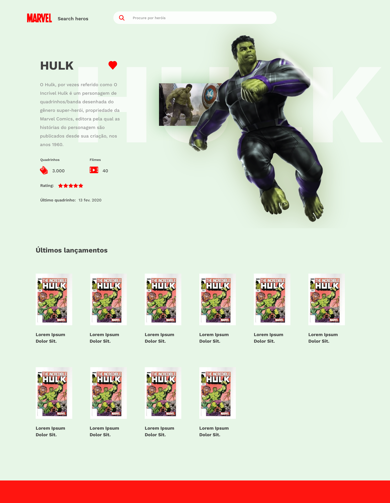

# Buscador de heróis da Marvel

Projeto de uma SPA de duas páginas, uma página de busca de heróis da Marvel e outra página de detalhes do herói.

- [Requisitos](./docs/00_requisitos.md)
- [Link do projeto](https://buscador-de-herois-marvel.vercel.app/)

## Páginas

- [Busca de heróis](#busca-de-heróis)
- [Detalhes do herói](#detalhes-do-herói)

### Busca de heróis


### Detalhes do herói



## Tecnologias

- [Vite](https://vitejs.dev/)
- [React](https://react.dev/)
- [TypeScript](https://www.typescriptlang.org/)

## Como rodar o projeto

Obs:

- Para rodar o projeto é necessário ter o [Node.js](https://nodejs.org/) instalado.
- Todos os comandos só funcionaram se tiver configurado .env
- Rode `nvm use` para usar a versão do node.js utilizada no projeto.
  - caso não tenha a versão do node.js utilizada no projeto, instale com `nvm install`.

### Como rodar o projeto localmente

```bash
# Clonar o repositório
git clone git@github.com:glaucioripol/marvel-search-heroes.git

# Para usar a versão do node.js utilizada do projeto
nvm use

# Instalar as dependências, opcional caso já tenha as dependências instaladas
npm install # ou yarn

# Rodar o projeto
npm run dev # ou yarn dev
```

### Como rodar os testes

```bash
# Rodar os testes

npm run test # ou yarn test
```

### Como rodar os testes de e2e

```bash
# Rodar o projeto
npm run dev # ou yarn dev

# Rodar os testes de e2e

npm run cy:run # ou yarn test:e2e
```

### Como rodar o build

```bash
# Rodar o build

npm run build # ou yarn build
```
